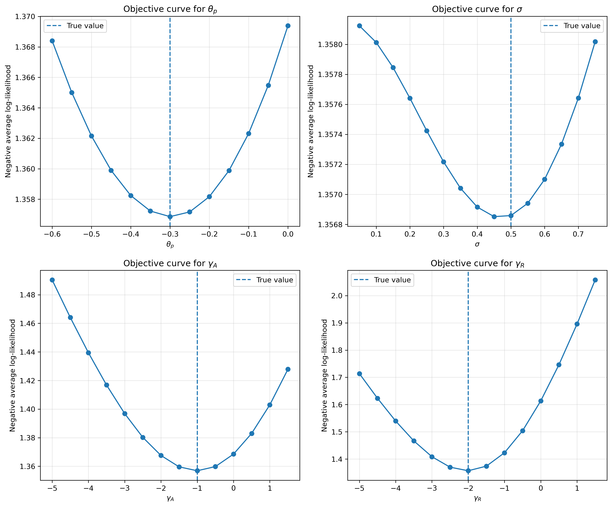

# Switching Cost Calibration and Parameter Recovery

This repository demonstrates an end-to-end **parameter recovery exercise** for a discrete-choice demand model with **switching costs and individualized contract prices**, motivated by retail electricity markets.

The goal is to show how to estimate structural paremters using **random-coefficient logit demand**, **contraction mapping**, and **simulated maximum likelihood** from a simulated data and pre-set parameters. 

---

## Project Overview

The project proceeds in three main steps:

1. **Simulate data** from a structural demand model with:
   - Households switching costs
   - Retailer-specific contract lengths
   - Sticky prices for households who stay with their current retailer
2. **Estimate the model** using:
   - A BLP-style contraction mapping to recover mean utilities
   - Halton draws for random coefficients
   - SQUAREM acceleration to improve convergence
3. **Validate identification** by plotting the objective function as key parameters vary and verifying that the true parameters are recovered.

This type of workflow is standard in empirical industrial organization and policy evaluation, but requires careful implementation to ensure numerical stability and correct identification.

---
## Why This Matters
This project demonstrates core tools used in empirical industrial organization and applied microeconomics:

- structural demand estimation
- handling consumer inertia
- solving fixed-point problems
- scalable likelihood computation

These methods are widely used in energy markets, antitrust, and policy evaluation. 

---
## Environment

The market consists of two types of retailers:
- AREP (incumbent): the retail arm of the former monopoly utility
- REP (entrants): competing retailers
 
At the start of the sample period, all households are served by the AREP. In each period (month), households choose a retailer to maximize utility. 

Switching between retailers incurs a cost, which is allowed to differ depending on whether the household switches away from the AREP or from a REP. 

---

## Economic Model

Household $i$ with retailer $k$ in last period chooses retailer $j$ in period $t$ to maximize utility:

```math
u_{ijt \mid k} =
\begin{cases}
\theta_0 + \theta_p p_{j,\tau_i}
+ (\theta_1 + v_i)\,\mathrm{AREP}_j
+ \text{Year FE} + \text{Q FE}
+ \xi_{jt} + \epsilon_{ijt},
& \text{if } j = k \text{ (locked)} \\[1.2ex]

\theta_0 + \theta_p p_{jt}
+ (\theta_1 + v_i)\,\mathrm{AREP}_j
+ \text{Year FE} + \text{Q FE}
+ \xi_{jt} + \epsilon_{ijt},
& \text{if } j = k \text{ (renewal)} \\[1.2ex]

\theta_0 + \theta_p p_{jt}
+ (\theta_1 + v_i)\,\mathrm{AREP}_j
+ \gamma_A^{sw}\mathbf{1}\{k=\text{AREP}\}
+ \gamma_R^{sw}\mathbf{1}\{k=\text{REP}\} \\
\qquad
+ \text{Year FE} + \text{Q FE}
+ \xi_{jt} + \epsilon_{ijt},
& \text{if } j \ne k.
\end{cases}
```

Utility consists of two components: 

1. **Retailer-Time Mean Utility**

   The retailer-time component is defined as:

   $$\delta_{jt} = \theta_0 + \text{Year FE} + \text{Q FE} + \xi_{jt}$$
   
   This captures common utility across households, including time effects (Year FE, Q FE) and unobserved demand shocks $\xi_{jt}$
2. **Individual-Specific Utility**
 
   The individual level component vaires depending on the conumser's state:

   - Case 1: Households in an active contract ($j = k$) 
      
      Households are currently in the middle of a contract with retailer j. They can switch to another retailer, but if they choose to stay, they continue under the existing contract and face the pre-determined price $p_{j,\tau_i}$, which was set at the time the contract was signed ($\tau_i$). 
      
      Preference heterogeneity is captured by a random coefficient $v_i$ ~ $N(0, \sigma)$ on the AREP indicator, along with an idiosyncratic shock $\epsilon_{ijt}$ that follows a Type I extreme value distribution. 
      

   - Case 2: Households upon renewal ($j=k$)
      
      Households whose contract has expired choose whether to stay and face the current price $p_{jt}.

   - Case 3: Switching households ($j \ne k$)
   
      Households choosing a different retailer incur switching costs:
      - $\gamma_A^{SW}$: switching away from AREP
      - $\gamma_R^{SW}$: switching away from REP

**Importantly, no switching cost is incurred when households remain with the same retailer.**

<!-- This switching cost captures both financial penalties for early termination and non-financial costs such as paperwork, time, and psychological effort. During the sample period, AREP contracts were monthly, while REP contracts were annual or longer. Switching away from an AREP did not involve termination fees, whereas switching away from an REP during an active contract usually entailed small but positive fees. In the data, however, I observe that the switching rate from AREP is consistently lower than the switching rate from REP. All of these suggest that the switching cost varies depending on whether $k$ is AREP or REP.  -->

Finally, all fringe retailers outside the main set are grouped into an outside option:

```math
u_{i0t} = \epsilon_{i0t}
```
---
## Estimation Objective
The goal is to estimate the following structural parameters: 
- Price sensitivity: $\theta_p$
- Preference heterogeneity: $\sigma$
- Switching costs: $\gamma_A^{SW}$, $\gamma_R^{SW}$
- Mean utilities: $\delta_{jt}$


---

## Data Simulation

The simulated dataset includes:

- **Non-movers**: households that appear in all periods
- **Movers**: households that appear for a single period, **do not have previous retailer**
- **Retailer-level variables**: monthly prices $p_{jt}$, retailer-time mean utility $\delta_{jt}$
- **Household-level states**: contract states (number of months with the contract) and individualized prices based on contract timing

Household choices are generated using the **explicit Gumbel shock formulation**. In each period, households draw idiosyncratic shocks and choose the retailer that maximized their realized utility $u_{ijt}$. 

This approach directly simulates discrete choices from the underlying random utility model, ensuring consistency with the logit structure used in estimation. 

---

## Estimation Strategy

The estimation combines a BLP-style inversion for mean utilities with a simulated maximum likelihood (SML) framework:

1. **Recover Mean utilities \($\delta_{jt}$\)** 
   
   Mean utilties are obtained via a contraction mapping that matches observed market shares with model-predicted shares, following the standard BLP inversion.
2. **Accelerate convergence**
   
   The contraction mapping is implemetned with **SQUAREM** acceleration to imrove convergence speed and numerical stability. 

3. **Integrate over heterogeneity**

   The likelihood is evaluated by integrating over random coefficients using Halton draws, which provide an efficient approximation to the underlying distribution. 
    
4. **Estimate structural parameters via SML**
   
   The parameters $(\theta_p, \sigma, \gamma_A, \gamma_R)$ are estimated by maximizing the likelihood of the observed household choice paths. This approach directly leverages micro-level choice data, allowing the model to capture both heterogeneity in preferences and switching behavior.

To diagnose identification, the objective function is evaluated on a grid of parameter values (e.g. varying $\sigma$ while holding other parameters fixed).

---

## Repository Structure
```
Switching-Cost-Calibration-Exercise-1/
├── src/
│   ├── simulate.py
│   ├── build_dataset.py
│   └── estimation.py
│
├── notebooks/
│   ├── 01_parameter_recovery_demo.ipynb            
│   ├── figures/                              
│   │   └── objective_curves.png                             
│
├── README.md                                
├── requirements.txt                          
├── .gitignore  
```

<!-- ## Example Result: Objective Function

As a validation step, the negative log-likelihood is evaluated over a grid of values for the random-coefficient standard deviation \($\sigma\$):

```python
sigma_grid = np.arange(0, 0.5, 0.1)
obj_sigma = [LL([-0.3, s, -3, -6]) for s in sigma_grid]

plt.plot(sigma_grid, obj_sigma)
plt.axvline(sigma_true, linestyle="--")
plt.xlabel("sigma")
plt.ylabel("negative log-likelihood")
plt.title("Objective function over sigma")
plt.show()
```
This exercise provides a simple but power diagnostic of identification: the objective dunction should be well-behaved and attain its minimum near the true parameter value used in data generation. 

A well-defined curvature around the optimum indicates that the model is informative about $\sigma$, while a flat or irregular shape would suggest weak identification or numerical issues. -->


## Key Result
## Objective Function Validation

The figure below shows the negative log-likelihood evaluated over grids for each parameter, holding others fixed at their true values.

The objective is minimized near the true parameter values.



## Parameter Recovery

The table below compares true and estimated parameters:


|Parameter	|True Value	|Estimated Value	| Error	Abs Error|
|-----------|-----------|-----------------|-----------------|
|$\theta_p$	| -0.3000|	-0.2950	|0.0050|	0.0050|
| $\sigma$| 	0.5000	| 0.4585| 	-0.0415| 0.0415| 
| $\gamma_A$	| -1.0000| 	-1.0151	| -0.0151	| 0.0151| 
| $\gamma_R$	| -2.0000| 	-2.0231	| -0.0231| 	0.0231| 


The estimation successfully recovers the underlying parameters.

**Reproducibility**

A fully reproducible implementation of this exercise, including the likelihood function LL and simulated dataset, is available in:
[`notebooks/01_parameter_recovery_demo.ipynb`]

To reproduce the results:

1. Clone the repository
2. Install dependencies
3. Open the notebook:
   notebooks/01_parameter_recovery_demo.ipynb
4. Run all cells

The notebook uses cached results by default.  
Set `use_cache = False` to recompute results from scratch.